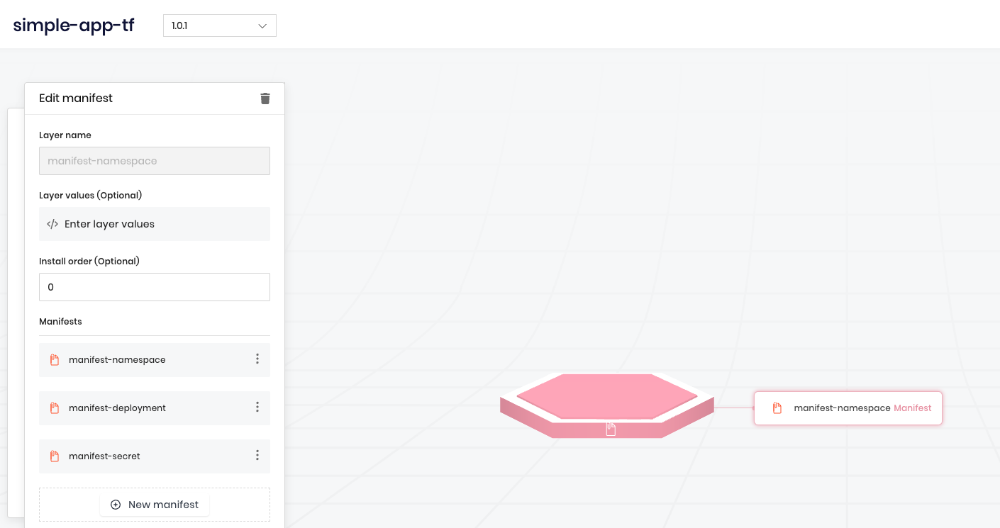
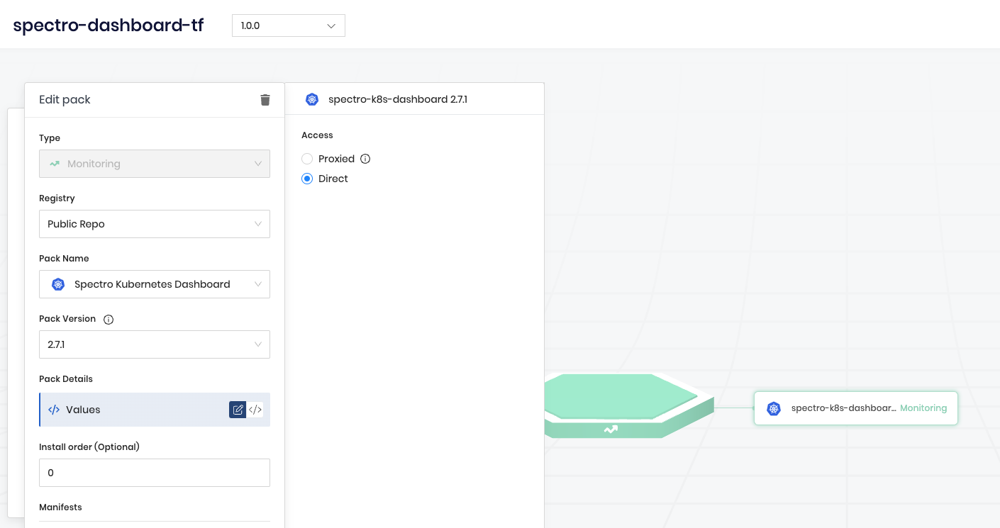
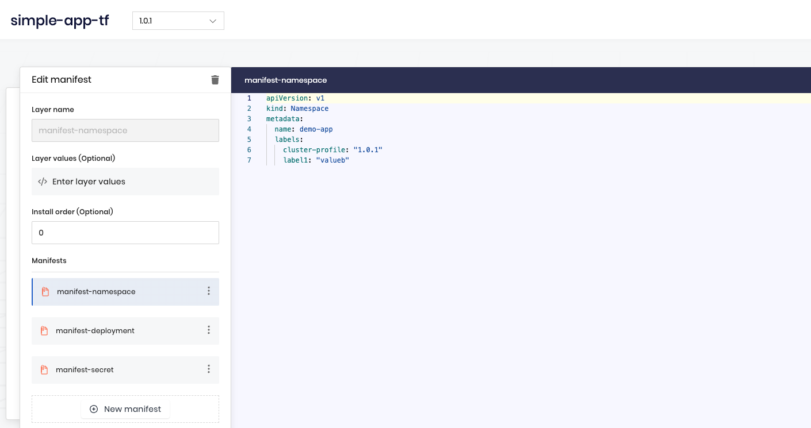

# Manage K8S clusters using GitOps and Palette Examples

This repository consists of examples on how to implement GitOps to manage Kubernetes clusters using Palette, Terraform, YAML files containing Kubernetes manifests or Spectro pack values and GitHub workflows. 

Examples, provided in this repo, create two Palette cluster profiles:
* **simple-app-tf** - add-on cluster profile with one simple application based on Kubernetes manifests (namespace, deployment, secret), stored in `simple-app-manifests-profile/manifests` directory;
* **spectro-dashboard-tf** - add-on cluster profile to deploy Spectro Kubernetes Dashboard pack, where values stored as YAML file in `spectro-dashboard-profile` directory.

For each of the listed profiles there is a corresponding GitHub workflow in `.github/workflows` directory, which triggers when users push or merge changes to the `main` branch
Once users update applications configuration (values or Kubernetes manifests) the corresponding GitHub workflow triggers and updates cluster profile accordingly.

GitHub workflows saves TF state in S3 object storage, and to access the storage it is using environment variables, stored as GitHub secrets.

## Get Started

Use the following steps to try these examples.

### Pre-requisites

* Fork the repository
* Create GitHub secrets for the repostory:

    For Terraform to access S3 object storage:

        * AWS_ACCESS_KEY_ID - access key for TF S3 backend
        * AWS_SECRET_ACCESS_KEY - secret access key for TF S3 backend
        * AWS_REGION - AWS region (set this to `main` if use on-prem S3 storage like minio )
        * *optionally, if use on-prem S3 storage like minio* - AWS_S3_ENDPOINT: 'S3 URL'
        * BUCKET_TF_STATE: 'Bucket to store TF state'

    For Terraform to access Spectro Cloud Palette:

        * SC_API_KEY - Spectro Cloud Palette API Key
        * SC_PROJECT_NAME Spectro Cloud Palette Project Name

### Steps

After creating all required secrets in the repository, go to **Actions** menu and trigger the workflow manually. 

Ensure corresponding cluster profiles created:

Update manifest in `simple-app-manifests-profile/manifests`, push the changes and ensure changes has been applied to the profile. For example, changing label value for [namespace manifest](simple-app-manifests-profile/manifests/namespace.yaml) triggers the worflow to update cluster profile in Palette:

Do the same but for Spectro Dashboard pack - change value `palette.config.dashboard.access` in values YAML file from `public` to `private` and ensure cluster profile updated in Palette:

